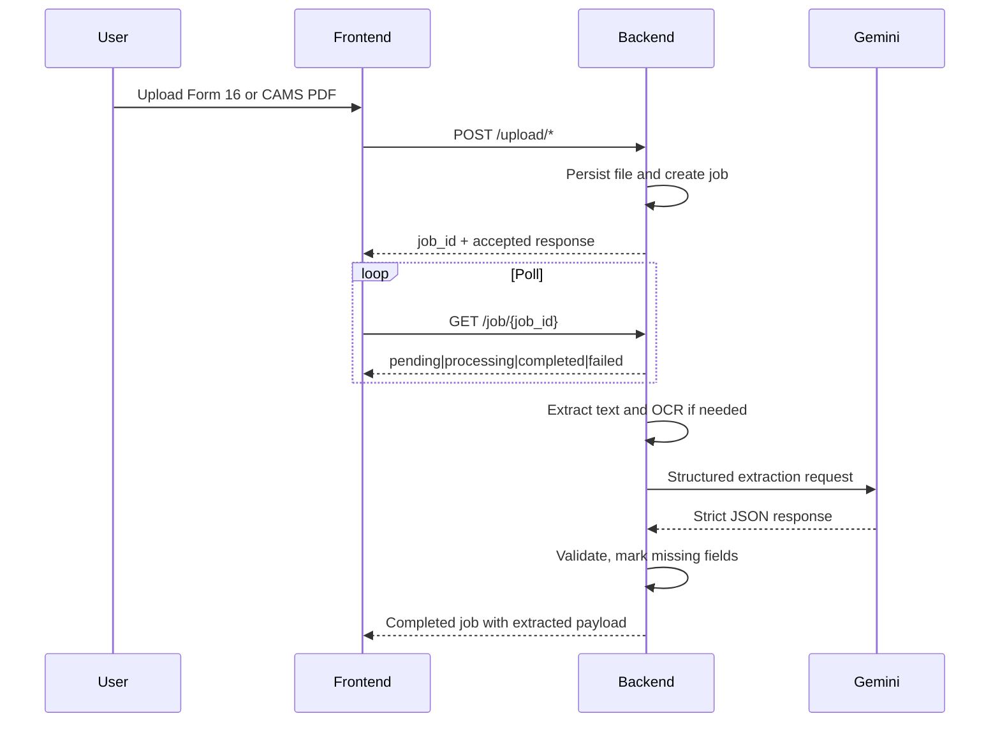
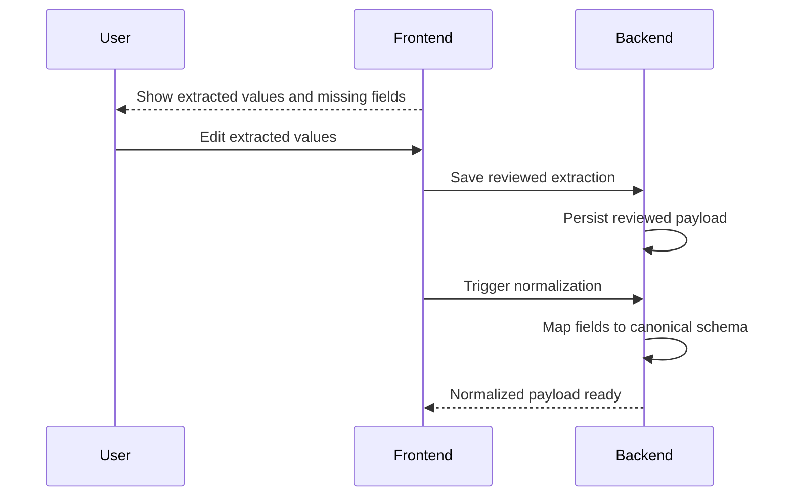
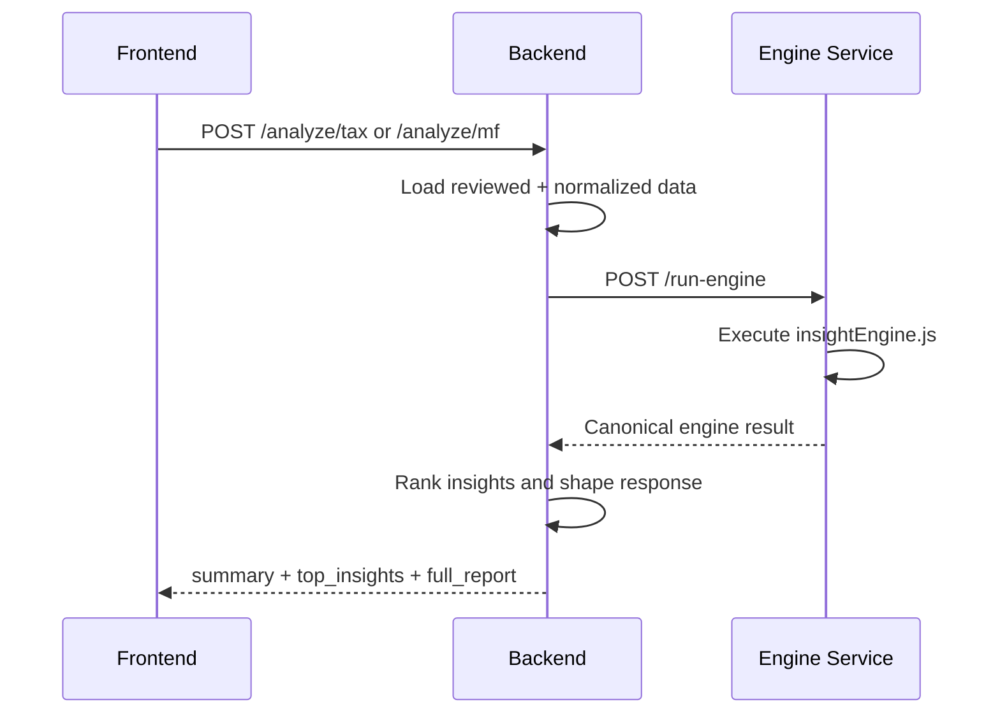
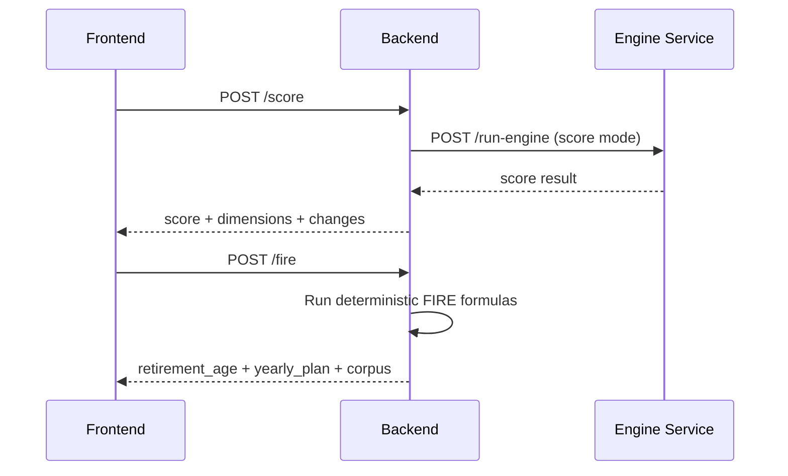

# Sequence flows

## Upload and extraction

```mermaid
sequenceDiagram
  participant U as User
  participant F as Frontend
  participant B as Backend
  participant G as Gemini

  U->>F: Upload Form 16 or CAMS PDF
  F->>B: POST /upload/*
  B->>B: Persist file and create job
  B-->>F: job_id + accepted response
  loop Poll
    F->>B: GET /job/{job_id}
    B-->>F: pending|processing|completed|failed
  end
  B->>B: Extract text and OCR if needed
  B->>G: Structured extraction request
  G-->>B: Strict JSON response
  B->>B: Validate, mark missing fields
  B-->>F: Completed job with extracted payload
```

## Review and normalization

```mermaid
sequenceDiagram
  participant U as User
  participant F as Frontend
  participant B as Backend

  F-->>U: Show extracted values and missing fields
  U->>F: Edit extracted values
  F->>B: Save reviewed extraction
  B->>B: Persist reviewed payload
  F->>B: Trigger normalization
  B->>B: Map fields to canonical schema
  B-->>F: Normalized payload ready
```

## Tax and MF analysis

```mermaid
sequenceDiagram
  participant F as Frontend
  participant B as Backend
  participant E as Engine Service

  F->>B: POST /analyze/tax or /analyze/mf
  B->>B: Load reviewed + normalized data
  B->>E: POST /run-engine
  E->>E: Execute insightEngine.js
  E-->>B: Canonical engine result
  B->>B: Rank insights and shape response
  B-->>F: summary + top_insights + full_report
```

## Score and FIRE

```mermaid
sequenceDiagram
  participant F as Frontend
  participant B as Backend
  participant E as Engine Service

  F->>B: POST /score
  B->>E: POST /run-engine (score mode)
  E-->>B: score result
  B-->>F: score + dimensions + changes

  F->>B: POST /fire
  B->>B: Run deterministic FIRE formulas
  B-->>F: retirement_age + yearly_plan + corpus
```
